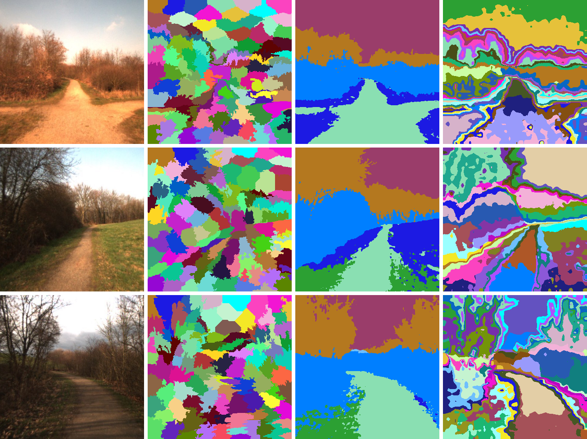

# Self-Supervised Semantic Segmentation for Wild Visual Navigation

This is the implementation of the project "Semantic Understanding of Outdoor Environments for Navigation" completed at the Robotic Systems Lab at ETH Zurich in the Spring Semester 2023.

The goal of the project was to investigate how the recent unsupervised semantic segmentation model STEGO ([Hamilton et al., 2022](https://arxiv.org/pdf/2203.08414.pdf)) could be used in an outdoor navigation pipeline for a ground mobile robot, with the main focus on the context of the Wild Visual Navigation system ([Frey & Mattamala et al.](https://sites.google.com/leggedrobotics.com/wild-visual-navigation)).


This package is built on a refactored version of [STEGO: Unsupervised Semantic Segmentation by Distilling Feature Correspondences](https://github.com/mhamilton723/STEGO) by Hamilton et al.


_SLIC (WVN's segmentation method), standard STEGO, and STEGO with per-image feature clustering segmenting natural scenes._

## Contents
   * [Setup](#setup)
     * [Installation](#installation)
     * [Dataset Download](#download-datasets)
     * [Data Preprocessing](#preprocess-datasets)
     * [Model Download](#download-and-convert-stego-models)
     * [KNN Preprocessing](#precompute-knns)
   * [Demo Segmentation](#run-demo-segmentation)
   * [Evaluate Segmentation](#evaluate-segmentation)
   * [Train Segmentation](#train-segmentation)
   * [Evaluate for WVN](#evaluate-segmentation-for-wvn)
   * [Generate Plots](#generate-plots)
   * [License](#license)


## Setup

### Installation

Clone the repository:
```
git clone https://github.com/leggedrobotics/self_supervised_segmentation.git
cd self_supervised_segmentation
```
Install the environment:
```
conda env create -f environment.yml
conda activate stego
pip install -e .
```

### Download datasets

Download general datasets used by Hamilton et al.:
```
python scripts/download_stego_datasets.py
```
**_NOTE:_** `wget`, which is used in the download scripts might not always work well with these large downloads. In case the download fails, try downloading the selected datasets with [azcopy](https://learn.microsoft.com/en-us/azure/storage/common/storage-use-azcopy-v10). For example, to download the cocostuff dataset:

```
azcopy copy https://marhamilresearch4.blob.core.windows.net/stego-public/pytorch_data/cocostuff.zip ./cocostuff.zip
```

In the case of the cocostuff dataset, Hamilton et al. use subsets of training and validation samples for experiments, which were also used in this project. Lists of samples can be obtained by downloading the dataset from the link above. Then, a dataset curated according to a selected list can be generated with `scripts/create_curated_dataset.py`.

Download datasets with natural scenes:
```
# Download RUGD
wget http://rugd.vision/data/RUGD_frames-with-annotations.zip
wget http://rugd.vision/data/RUGD_annotations.zip
unzip RUGD_frames-with-annotations.zip -d RUGD
unzip RUGD_annotations.zip -d RUGD
rm RUGD_annotations.zip RUGD_frames-with-annotations.zip

# Download Freiburg Forest
wget http://deepscene.cs.uni-freiburg.de/static/datasets/download_freiburg_forest_annotated.sh
bash download_freiburg_forest_annotated.sh
tar -xzf freiburg_forest_annotated.tar.gz
rm freiburg_forest_annotated.tar.gz*
```

### Preprocess datasets

To facilitate using various datasets with the package, preprocessing scripts have been added to `scripts/data_preprocessing`. Before running, adjust paths in each preprocessing script.

Cocostuff preprocessing:
```
# Preprocess full Cocostuff
python scripts/data_preprocessing/preprocess_cocostuff.py

# Create the curated dataset
python scripts/data_preprocessing/create_curated_dataset.py

# Crop the dataset (only for training)
python scripts/data_preprocessing/crop_dataset.py
```

RUGD preprocessing:
```
# Preprocess RUGD
python scripts/data_preprocessing/preprocess_RUGD.py

# Crop the dataset (only for training)
python scripts/data_preprocessing/crop_dataset.py
```

Freiburg Forest preprocessing:
```
# Preprocess Freiburg Forest
python scripts/data_preprocessing/preprocess_freiburg_forest.py

# Crop the dataset (only for training)
python scripts/data_preprocessing/crop_dataset.py
```

To use custom data with this package preprocess it to have the following structure:
```
YOUR_DATASET
|-- imgs
    |-- train
    |-- val
|-- labels
    |-- train
    |-- val
```
With RGB images in the `imgs` directory, and (optionally) annotations in the `labels` directory.

If the `labels` directory is provided it should contain a label for all images in `imgs`, with each label named the same as its corresponding image (excluding file extension).
Annotations should be provided as single-channel masks of the same size as their corresponding images.

### Download and convert STEGO models

Download STEGO model checkpoints:

```
python scripts/download_stego_models.py
```

Convert selected checkpoints to the model structure used by this package.
Set input and output paths in `scripts/cfg/convert_checkpoint_config.yaml` and run:
```
python scripts/convert_original_stego_checkpoint.py
```

### Precompute KNNs

To use a preprocessed dataset with a selected model and at a selected resolution, the `precompute_knns.py` script needs to be run with the selected parameters and model.
This will create the nearest neighbors file in a separate subdirectory `nns` of the selected dataset.
Adjust the parameters in `scripts/cfg/knn_config.yaml` and run:
```
python scripts/precompute_knns.py
```


## Run demo segmentation
To generate segmentation predictions for a selected folder of images:
- Adjust input and output paths in `scripts/cfg/demo_config.yaml`
- Run:
```
python scripts/demo_segmentation.py
```
This will generate visualizations of unsupervised segmentations in `output_dir/experiment_name/cluster` and visualizations of linear probe segmentations in `output_dir/experiment_name/linear`.


## Evaluate segmentation
To evaluate STEGO on a selected dataset with unsupervised metrics:
- Adjust paths and parameters in `scripts/cfg/eval_config.yaml`
- Run:
```
python scripts/eval_segmentation.py
```
The script will calculate and print the results of the evaluation on the given data.

## Train segmentation
After performing the preprocessing steps outlined in [Setup](#setup), you can train STEGO on the selected data.

Before training, select the backbone and adjust the parameters of the model and the training.

### STEGO's backbone

STEGO was built based on DINO ViT, but it can be used with any Vision Transformer.
All available backbones can be found in `stego/backbones/backbone.py`.
To add a new backbone, add all code necessary for the backbone to the `stego/backbones` folder and modify `stego/backbone/backbones.py`:
- Add an implementation of the `Backbone` class for your backbone,
- Add your implementation to the `get_backbone` function with the desired name.

### Parameters

The parameters of STEGO are specified in `stego/cfg/model_config.yaml`. In this file you can:
- select the backbone,
- specify other model parameters,
- specify training parameters: learning rates and STEGO's correspondence loss parameters.

Other parameters for training can be set in `scripts/cfg/train_config.yaml`.

After adjusting the parameters, run the training with:
```
python scripts/train.py
```

### Checkpoints and Logging

STEGO is implemented with Pytorch Lightning, which handles saving the checkpoints during training, in a directory that can be specified in `scripts/cfg/train_config.yaml`.

Logging is implemented with Weights & Biases. To use W&B over cloud, login to wandb:
```
wandb login
```
During training, apart from unsupervised metrics, loss values and other parameters, visualizations of sample segmentations and the learned feature similarity distribution plot are logged.


## Evaluate segmentation for WVN
To run the experiment that compares segmentation methods in the context of an outdoor navigation pipeline:
- Generate binary traversability labels for a selected dataset. Currently, only preprocessing for Freiburg Forest is available. However, you can also preprocess different datasets for this experiment with this script provided that you change `TRAVERSABLE_IDS` to IDs of traversable classes in your dataset. Run:
```
# Adjust paths in the script before running
python scripts/data_preprocessing/generate_traversability_labels_freiburg_forest.py
```
- Adjust parameters in `scripts/cfg/eval_clusters_wvn.yaml`
- Run:
```
python scripts/eval_clusters_wvn.py
```
The script will calculate and print the results of the evaluation on the given data, and save the selected visualizations.

## Generate plots
The `scripts/plot.py` script enables generation of precision-recall curves showing the performance of features in predicting label co-occurrence.
It also provides an interactive plot visualizing feature similarities in selected images.

To generate the plots:
- Adjust paths and parameters in `scripts/cfg/plot_config.yaml`
- Run:
```
python scripts/plot.py
```

## License
```
Copyright (c) 2022-2024, ETH Zurich, Piotr Libera, Jonas Frey, Matias Mattamala.
All rights reserved. Licensed under the MIT license.
```

This project is based on previous work by Mark Hamilton.
```
Copyright (c) Mark Hamilton.
All rights reserved. Licensed under the MIT license.
```

Files in `stego/backbones/dino` are licensed under the Apache 2.0 license by Facebook, Inc. and its affiliates. See the file headers for details.